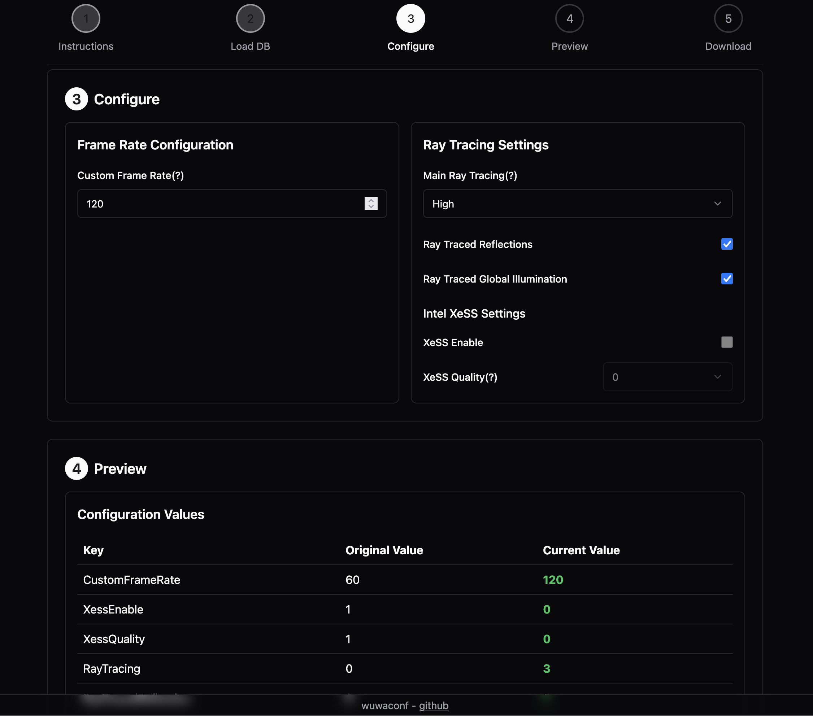

# wuwaconf

A simple web Wuthering Waves FPS Unlocker. Drag and drop your LocalStorage.db file onto the page, tweak the configuration, and download the modified file all in your browser without any downloads.

## Instructions

1. Head over to https://wuwa.kyou.dev
2. Drag and drop your `LocalStorage.db` file onto the page.
3. Tweak the configuration.
4. Click "Download Modified File" and replace the `LocalStorage.db` file in your game folder.

## Why did you make this?

There's lots of existing and popular ways to do this. But I personally dislike downloading a program just to modify a *tiny database* by an even *tinier* amount. Typing `sqlite3 LocalStorage.db` is too much effort of course.
